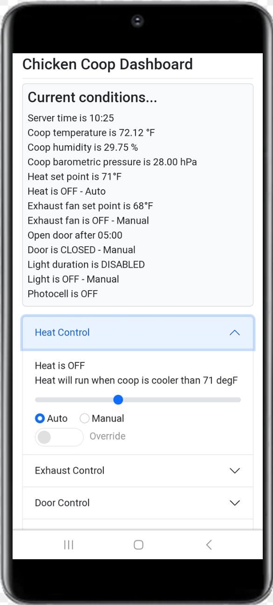
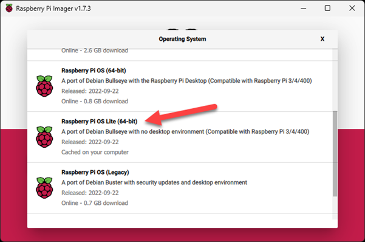

# Raspberry Pi Chicken Coop GUI Project


## [See completed GUI on YouTube](https://www.youtube.com/watch?v=uRa9NeWi5xM)
## Screenshot of phone


This is a NODE.js application to control the chicken coop environment with a Raspberry Pi. The concept was proposed to me when my son-in-law introduced me to the Raspberry PI and suggested it could control some of the things we do manually for the chickens.

I share with you what I did and what I used that worked. However, you are welcome to deviate from that if you wish. Your mileage may vary.

### Hardware Requirements
* [Raspberry PI](https://www.raspberrypi.com/products/raspberry-pi-4-model-b/) 4 Model B with 2 GB RAM
* [SainSmart](https://www.sainsmart.com/products/8-channel-5v-relay-module?variant=39377806065743&currency=USD&utm_medium=product_sync&utm_source=google&utm_content=sag_organic&utm_campaign=sag_organic&gclid=Cj0KCQiA_P6dBhD1ARIsAAGI7HDaAIN8Izg_Fhc1XHP0P8aSA2_mhBZBZiWY8z94NpUIVyyLVXFI4msaAgldEALw_wcB) 8-Channel 5V Relay Module. 
* Adafruit [BME280](https://www.adafruit.com/product/2652?gclid=Cj0KCQiA_P6dBhD1ARIsAAGI7HBVdWbvK-0emGKiYDhDsp5952fc_IsTkwZ4piquaf68jzaguE8LvsMaAhG5EALw_wcB) I2C Temperature Humidity Pressure Sensor.
* Adafruit [LTC4311](https://www.adafruit.com/product/4756) I2C Extender

### Modules
* [node](https://nodejs.org/en/) 18.13.0 LTS
* [bme280](https://github.com/fivdi/bme280) I2C driver for the BME280 sensor on the Raspberry Pi
* [onoff](https://www.npmjs.com/package/onoff) GPIO access and interrupt detection on the Raspberry Pi 
* [fastify](https://www.fastify.io/) web framework for Node.js.
* [@fastify-static](https://github.com/fastify/fastify-static) Plugin for serving static files as fast as possible.
* [fastify-socket.io](https://github.com/alemagio/fastify-socket.io) Enables the use of Socket.io in a Fastify app.
* [socket.io](https://socket.io/) Enables bidirectional and event-based communication between a client and a server.
* [bootstrap](https://getbootstrap.com/) Allows for proper responsive behavior in mobile devices.


### Raspberry PI 64-bit OS Lite



### Photocell Configuration


### GPIO Configuration


## Retrieve the Humidity, Pressure and Temperature to be used in the environment control routines

Note: Once the event listeners are registered in memory, the While Loop is where controlling takes place. There is a delay shown here. I have used 2-3 seconds with no ill effects but you can delay longer if you like. 

```js
const runApplication = async _ => {
  const format = number => (Math.round(number * 100) / 100).toFixed(2)
  const delay = millis => new Promise(resolve => setTimeout(resolve, millis))

  while (true) {
    const sensor = await bme280.open({
      i2cBusNumber: 1,
      i2cAddress: 0x77,
      humidityOversampling: bme280.OVERSAMPLE.X1,
      pressureOversampling: bme280.OVERSAMPLE.X16,
      temperatureOversampling: bme280.OVERSAMPLE.X2,
      filterCoefficient: bme280.FILTER.F16
    })

    const reading = await sensor.read()
    objConfig._degC = format(reading.temperature)
    objConfig._degF = format((objConfig._degC * 1.8) + 32)
    objConfig._pctRH = format(reading.humidity)
    objConfig._inHg = format(reading.pressure * 0.02953)

    // console.log(objConfig._degC + ' degC ' + objConfig._degF + ' degF ' + objConfig._pctRH + '% RH ' + objConfig._inHg + ' inHg')

    await sensor.close()

    await delay(2000) // 1000 = 1 second
    await heatController()  // see controller logic example below
    await exhaustController()
    await doorController()
    await lightController()
    refreshPageData() // see example below
  }
}
```

## Example of the controller logic for the heat

We turn on/off the gpio as needed but only write the text "ON" or "OFF" to the config file. After the config object is populated it is then sent to the client via sockit-io. 

```js
async function heatController () {
  // console.log(`_heatMode: ${objConfig._heatMode} -- _heatRelayTxt: ${objConfig._heatRelayTxt}  -- gpioHeat.readSync(): ${gpioHeat.readSync()}`)
  // Only run if mode = Auto
  if (objConfig._heatMode === 'Auto') {
    if (objConfig._degF < objConfig._heatSetPnt) {
      // Console.log('Turning Relay ON');
      if (gpioHeat.readSync() === off) {
        gpioHeat.writeSync(on) // Turn relay on
      }
      objConfig._heatRelayTxt = 'ON'
    }

    if (objConfig._degF > (objConfig._heatSetPnt + 1)) {
      // Console.log('Turning Relay OFF');
      if (gpioHeat.readSync() === on) {
        gpioHeat.writeSync(off) // Turn relay off
      }
      objConfig._heatRelayTxt = 'OFF'
    }
  } else {
    // Only run if mode = Manual
    if (objConfig._heatRelayTxt === 'ON') {
      if (gpioHeat.readSync() === off) {
        gpioHeat.writeSync(on) // Turn relay on
      }
    } else {
      if (gpioHeat.readSync() === on) {
        gpioHeat.writeSync(off) // Turn relay off
      }
    }
  }
  // console.log(`HEAT -- DegF: ${objConfig._degF} -- SetPnt: ${objConfig._heatSetPnt} -- Mode: ${objConfig._heatMode} -- Relay: ${objConfig._heatRelayTxt} -- Gpio: ${gpioHeat.readSync()}`)
}
```

## Refresh the client page

The config object is populated by many different functions through out the code and finally is pushed to the client by this function.

```js
function refreshPageData () {
  // Send status to client only if there is a client connected.
  if (clientCnt > 0) {
    // Let's update the current time
    objConfig._svrTime = currentTime()
    // Monitor the gpio status
    objConfig._heatRelayTxt = gpioStatus(gpioHeat, 'OnOff')
    objConfig._exhaustRelayTxt = gpioStatus(gpioExhaust, 'OnOff')
    objConfig._doorRelayTxt = gpioStatus(gpioDoor, 'OpenClose')
    objConfig._lightRelayTxt = gpioStatus(gpioLight, 'OnOff')
    objConfig._photocellTxt = gpioStatus(gpioPhoto, 'OnOff')
    // push the data to the html page
    svr.io.sockets.emit('refreshPageData', objConfig)
  }
}
```

## Issues? Questions? Contributions?

Feel free to leave comments or questions in my [YouTube Video GUI](https://www.youtube.com/watch?v=uRa9NeWi5xM) or use the [Discussion Page](https://github.com/JPWaldin/RPI_Coop/discussions)